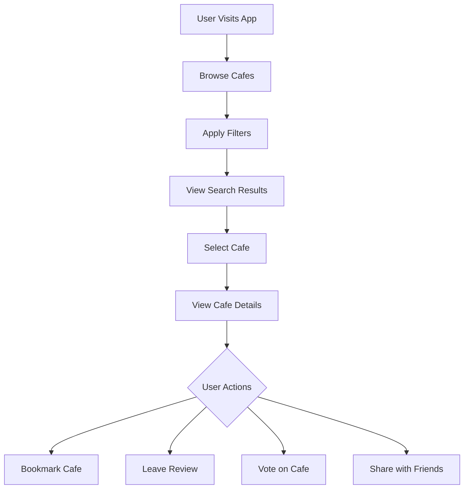
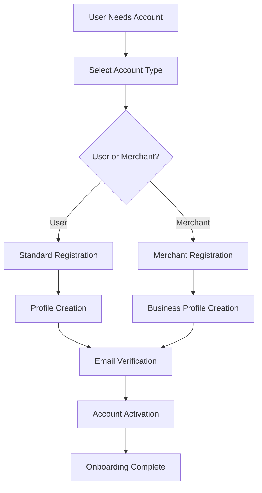
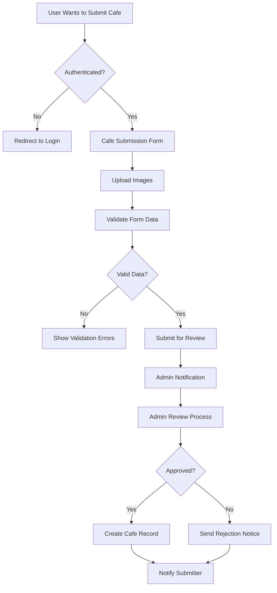
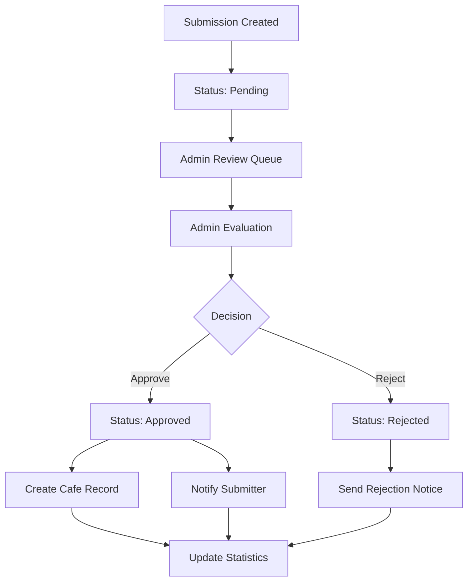

# Business Logic

This document provides comprehensive coverage of the business logic, user workflows, search algorithms, submission processes, and voting systems that power the cafe finder application.

## Overview

The business logic encompasses the core functionality that drives user interactions, cafe discovery, content moderation, and social engagement. It includes sophisticated algorithms for search, recommendation, and quality control while maintaining data integrity and user experience.

## User Workflows

### Primary User Journeys

#### Discovery Workflow


**Key Decision Points:**
- **Filter Application**: Users refine search based on location, amenities, price, ratings
- **Engagement Choice**: Users choose how to interact (bookmark, review, vote, share)
- **Social Integration**: Actions feed into social activity streams

#### Authentication Workflow


**Business Rules:**
- Account type determines feature access
- Merchant accounts require additional verification
- Profile completion before full feature access

#### Submission Workflow


## Search Algorithms

### Core Search Implementation

#### Text-Based Search
```typescript
// Multi-field search with fuzzy matching
const searchCafes = async (query: string, filters?: FilterOptions): Promise<Cafe[]> => {
  const searchPattern = `%${query}%`;
  
  // Search across multiple fields
  queryBuilder = queryBuilder.or(
    `name.ilike.${searchPattern},` +
    `description.ilike.${searchPattern},` +
    `location.ilike.${searchPattern}`
  );
}
```

**Search Strategy:**
- **Case-insensitive matching** using PostgreSQL `ilike` operator
- **Multi-field search** across name, description, and location
- **Partial matching** with wildcard patterns
- **Timeout protection** to prevent hanging queries

#### Location-Based Search
```typescript
// Geographic proximity search
if (filters?.nearMe) {
  const { latitude, longitude, radiusKm } = filters.nearMe;
  
  // Calculate distances for all cafes
  transformedCafes = transformedCafes.map((cafe: Cafe) => {
    const distance = calculateDistance(
      latitude, longitude,
      cafe.location.latitude, cafe.location.longitude
    );
    return { ...cafe, distance };
  });
  
  // Filter by radius
  if (radiusKm > 0) {
    transformedCafes = transformedCafes.filter(cafe => 
      cafe.distance <= radiusKm
    );
  }
}
```

**Distance Calculation:**
- **Haversine formula** for accurate geographic distance
- **Post-query filtering** to handle dynamic radius requirements
- **Distance annotation** on results for user display
- **Flexible radius** from precise (1km) to broad (50km+)

### Filter System Architecture

#### Filter Categories
```typescript
interface FilterOptions {
  // Location-based
  location?: string;           // City/area name search
  nearMe?: {                  // GPS-based proximity
    latitude: number;
    longitude: number;
    radiusKm: number;
  };
  
  // Amenity filters
  wifi?: boolean;             // WiFi availability
  powerOutlet?: boolean;      // Power outlet access
  
  // Environment filters
  seatingCapacity?: number;   // Minimum seats
  noiseLevel?: string;        // "Quiet", "Moderate", "Lively"
  priceRange?: string;        // Price tier
  
  // Quality filters
  upvotes?: number;           // Minimum upvotes
  downvotes?: number;         // Maximum downvotes
}
```

#### Filter Application Logic
```typescript
// Sequential filter application
if (filters.wifi === true) {
  queryBuilder = queryBuilder.eq('wifi', true);
}

if (filters.powerOutlet === true) {
  queryBuilder = queryBuilder.eq('powerOutletAvailable', true);
}

// Price range with special handling
if (filters.priceRange === '20') {
  queryBuilder = queryBuilder.gte('priceRange', 20); // $20 and above
} else {
  queryBuilder = queryBuilder.lte('priceRange', priceValue); // Up to $X
}
```

**Filter Logic:**
- **Additive filtering**: Multiple filters narrow results
- **Boolean amenity matching**: Exact match for WiFi/power
- **Range-based filtering**: Numeric comparisons for capacity/votes
- **Special price handling**: Support for open-ended ranges

### Search Performance Optimization

#### Query Optimization
```typescript
// Timeout protection for search queries
const timeoutPromise = new Promise<{data: null, error: Error}>((resolve) => {
  setTimeout(() => {
    resolve({
      data: null,
      error: new Error(`Search query timeout for '${query}'`)
    });
  }, 10000); // 10 second timeout
});

const { data: cafesData, error } = await Promise.race([
  queryBuilder,
  timeoutPromise
]);
```

**Performance Features:**
- **Query timeouts** prevent hanging requests
- **Indexed database fields** for fast filtering
- **Batch image loading** for search results
- **Lazy loading** for large result sets

## Submission Process

### User Submission Workflow

#### Form Validation
```typescript
interface SubmissionFormData {
  name: string;                    // Required: Cafe name
  description: string;             // Required: Cafe description
  address: string;                 // Required: Physical address
  city: string;                   // Required: City location
  country: string;                // Required: Country
  latitude?: number;              // Optional: GPS coordinate
  longitude: number;              // Required: GPS coordinate
  wifi: boolean;                  // Required: WiFi availability
  powerOutletAvailable: boolean;  // Required: Power availability
  seatingCapacity?: string;       // Optional: Seating info
  noiseLevel?: string;            // Optional: Noise level
  priceRange?: string;            // Optional: Price range
  images: File[];                 // Optional: Cafe photos
}
```

**Validation Rules:**
- **Required fields**: Name, description, location details
- **Geographic validation**: Latitude/longitude within valid ranges
- **Image constraints**: File size, format, quantity limits
- **Text length limits**: Prevent spam and database overflow

#### Image Processing
```typescript
// Upload images to Supabase Storage
const imageUrls: string[] = [];

if (formData.images.length > 0) {
  for (const image of formData.images) {
    const fileExt = image.name.split('.').pop();
    const fileName = `${Date.now()}-${Math.random().toString(36).substring(2)}.${fileExt}`;
    const filePath = `${user.id}/${fileName}`;
    
    const { error: uploadError } = await supabase.storage
      .from('submissions')
      .upload(filePath, image);
    
    if (!uploadError) {
      const { data: { publicUrl } } = supabase.storage
        .from('submissions')
        .getPublicUrl(filePath);
      
      imageUrls.push(publicUrl);
    }
  }
}
```

**Image Handling:**
- **User-specific folders** for organization
- **Unique filenames** to prevent conflicts
- **Error tolerance**: Continue if some uploads fail
- **Public URL generation** for display

### Admin Review Process

#### Review States
```typescript
type SubmissionStatus = 'pending' | 'approved' | rejected';

interface AdminReviewData {
  status: 'approved' | 'rejected';
  admin_notes?: string;        // Internal admin notes
  rejection_reason?: string;   // User-facing rejection reason
}
```

#### Review Workflow


#### Approval Process
```typescript
// Create approved cafe in main cafes table
const createCafeFromSubmission = async (submissionId: string): Promise<boolean> => {
  const { data: submission } = await supabase
    .from('cafe_submissions')
    .select('*')
    .eq('id', submissionId)
    .eq('status', 'approved')
    .single();
  
  const cafeData = {
    name: submission.name,
    description: submission.description,
    location: submission.location,
    wifi: submission.wifi,
    powerOutletAvailable: submission.powerOutletAvailable,
    seatingCapacity: submission.seatingCapacity,
    noiseLevel: submission.noiseLevel,
    priceRange: submission.priceRange,
    image_urls: submission.image_urls,
    upvotes: 0,                 // Start with zero votes
    downvotes: 0,
    submitted_by: submission.submitted_by  // Track original submitter
  };
  
  const { error } = await supabase
    .from('cafes')
    .insert(cafeData);
  
  return !error;
};
```

**Approval Logic:**
- **Data migration**: Transform submission to cafe record
- **Initial state**: Start with zero votes
- **Attribution**: Track original submitter
- **Atomicity**: All-or-nothing approval process

### Submission Statistics

#### Analytics Collection
```typescript
const getSubmissionStats = async (): Promise<SubmissionStats> => {
  const { data: allSubmissions } = await supabase
    .from('cafe_submissions')
    .select('status, created_at');
  
  const now = new Date();
  const weekAgo = new Date(now.getTime() - 7 * 24 * 60 * 60 * 1000);
  
  return {
    total: submissions.length,
    pending: submissions.filter(s => s.status === 'pending').length,
    approved: submissions.filter(s => s.status === 'approved').length,
    rejected: submissions.filter(s => s.status === 'rejected').length,
    recent_submissions: submissions.filter(s => 
      new Date(s.created_at) >= weekAgo
    ).length
  };
};
```

## Voting Systems

### Upvote/Downvote Mechanism

#### Vote Data Model
```typescript
// Separate tables for granular tracking
USER_UPVOTES_TABLE = 'user_upvotes';
USER_DOWNVOTES_TABLE = 'user_downvotes';

// Vote record structure
interface VoteRecord {
  id: string;
  user_id: string;    // Foreign key to profiles
  cafe_id: number;    // Foreign key to cafes
  created_at: string; // Timestamp
}
```

#### Vote Toggle Logic
```typescript
const toggleUpvote = async (cafeId: number) => {
  const session = await authService.getSession();
  if (!session) return { success: false };
  
  const isAlreadyUpvoted = await isCafeUpvoted(cafeId);
  
  if (isAlreadyUpvoted) {
    // REMOVE UPVOTE
    await supabase
      .from('user_upvotes')
      .delete()
      .eq('user_id', session.user.id)
      .eq('cafe_id', cafeId);
    
    // Decrement cafe upvote count
    const newUpvotes = Math.max(0, currentUpvotes - 1);
    await supabase
      .from('cafes')
      .update({ upvotes: newUpvotes })
      .eq('id', cafeId);
      
  } else {
    // ADD UPVOTE
    await supabase
      .from('user_upvotes')
      .insert({
        user_id: session.user.id,
        cafe_id: cafeId,
        created_at: new Date().toISOString()
      });
    
    // Increment cafe upvote count
    const newUpvotes = currentUpvotes + 1;
    await supabase
      .from('cafes')
      .update({ upvotes: newUpvotes })
      .eq('id', cafeId);
  }
};
```

#### Vote Integrity
```typescript
// Prevent negative vote counts
const newUpvotes = Math.max(0, (currentCafe?.upvotes || 0) - 1);

// User profile validation
const { data: userProfile } = await supabase
  .from('profiles')
  .select('id')
  .eq('id', userId)
  .single();

if (!userProfile) {
  return { 
    success: false,
    message: 'User profile not found. Please complete your profile first.'
  };
}
```

**Vote Business Rules:**
- **Authentication required**: Only logged-in users can vote
- **Single vote per user**: One upvote/downvote per cafe per user
- **Toggle functionality**: Users can change their vote
- **Count integrity**: Prevent negative vote counts
- **Profile validation**: Ensure user profile exists

### Review System Integration

#### Review with Rating
```typescript
interface Review {
  id: string;
  user_id: string;
  cafe_id: number;
  rating: boolean;    // true = positive, false = negative
  comment: string;
  created_at: string;
}
```

**Review Logic:**
- **Boolean rating system**: Simplified positive/negative ratings
- **Required comment**: Users must provide textual feedback
- **User attribution**: Reviews linked to user profiles
- **Cafe integration**: Reviews appear on cafe detail pages

## Quality Control Systems

### Content Moderation

#### Automated Validation
```typescript
// Form validation rules
const validateSubmission = (formData: SubmissionFormData) => {
  const errors: string[] = [];
  
  if (!formData.name || formData.name.length < 2) {
    errors.push('Cafe name must be at least 2 characters');
  }
  
  if (!formData.description || formData.description.length < 10) {
    errors.push('Description must be at least 10 characters');
  }
  
  if (!formData.latitude || !formData.longitude) {
    errors.push('Location coordinates are required');
  }
  
  return errors;
};
```

#### Admin Moderation Tools
```typescript
// Admin review capabilities
interface AdminActions {
  reviewSubmission: (id: string, decision: AdminReviewData) => Promise<boolean>;
  deleteSubmission: (id: string) => Promise<boolean>;
  getSubmissionStats: () => Promise<SubmissionStats>;
  moderateReviews: (reviewId: string, action: 'approve' | 'remove') => Promise<boolean>;
}
```

### Duplicate Prevention

#### Submission Deduplication
```typescript
// Check for similar cafes before submission
const checkForDuplicates = async (formData: SubmissionFormData) => {
  const { data: existingCafes } = await supabase
    .from('cafes')
    .select('name, location')
    .ilike('name', `%${formData.name}%`)
    .within('location', `${formData.latitude},${formData.longitude}`, 1000); // 1km radius
  
  return existingCafes?.length > 0;
};
```

## Recommendation Algorithms

### Personalized Recommendations

#### User Preference Learning
```typescript
// Analyze user behavior patterns
const analyzeUserPreferences = async (userId: string) => {
  const bookmarks = await bookmarkService.getUserBookmarks(userId);
  const upvotes = await upvoteService.getUpvotedCafes(userId);
  const reviews = await reviewService.getUserReviews(userId);
  
  // Extract preference patterns
  const preferences = {
    preferredAmenities: extractAmenityPreferences(bookmarks, upvotes),
    priceRangePreference: calculatePricePreference(bookmarks, upvotes),
    locationPreferences: analyzeLocationPatterns(bookmarks, upvotes),
    noisePreference: determineNoisePreference(reviews)
  };
  
  return preferences;
};
```

#### Collaborative Filtering
```typescript
// Find users with similar tastes
const findSimilarUsers = async (userId: string) => {
  const userBookmarks = await bookmarkService.getUserBookmarks(userId);
  const userBookmarkIds = userBookmarks.map(cafe => cafe.id);
  
  // Find users who bookmarked similar cafes
  const { data: similarUsers } = await supabase
    .from('bookmarks')
    .select('user_id, cafe_id')
    .in('cafe_id', userBookmarkIds)
    .neq('user_id', userId);
  
  // Calculate similarity scores and recommend based on their preferences
  return calculateUserSimilarity(similarUsers, userBookmarkIds);
};
```

### Content-Based Recommendations

#### Feature Extraction
```typescript
// Extract cafe features for recommendation
const extractCafeFeatures = (cafe: Cafe) => {
  return {
    hasWifi: cafe.wifi,
    hasPower: cafe.powerOutletAvailable,
    priceRange: parseInt(cafe.priceRange || '10'),
    noiseLevel: cafe.noiseLevel,
    upvoteRatio: cafe.upvotes / (cafe.upvotes + cafe.downvotes + 1),
    locationVector: [cafe.location.latitude, cafe.location.longitude]
  };
};
```

## Business Intelligence

### Analytics Collection

#### User Engagement Metrics
```typescript
interface EngagementMetrics {
  totalUsers: number;
  activeUsers: number;           // Last 30 days
  averageSessionDuration: number;
  mostPopularCafes: Cafe[];
  searchPatterns: SearchPattern[];
  conversionRates: {
    signupToFirstBookmark: number;
    visitToBookmark: number;
    searchToVisit: number;
  };
}
```

#### Business KPIs
```typescript
interface BusinessKPIs {
  cafeGrowthRate: number;        // New cafes per month
  userRetentionRate: number;     // 30-day retention
  submissionApprovalRate: number; // % of submissions approved
  averageRating: number;         // Across all cafes
  geographicCoverage: {
    countries: number;
    cities: number;
    averageCafesPerCity: number;
  };
}
```

### Performance Optimization

#### Caching Strategy
```typescript
// Cache frequently accessed data
const cacheManager = {
  popularCafes: new Map<string, Cafe[]>(),
  userPreferences: new Map<string, UserPreferences>(),
  searchResults: new Map<string, SearchResult>(),
  
  getCachedSearchResults: (query: string, filters: FilterOptions) => {
    const cacheKey = generateCacheKey(query, filters);
    return cacheManager.searchResults.get(cacheKey);
  },
  
  setCachedSearchResults: (query: string, filters: FilterOptions, results: Cafe[]) => {
    const cacheKey = generateCacheKey(query, filters);
    cacheManager.searchResults.set(cacheKey, {
      results,
      timestamp: Date.now(),
      ttl: 5 * 60 * 1000 // 5 minutes
    });
  }
};
```

#### Database Optimization
```sql
-- Index optimization for search performance
CREATE INDEX idx_cafes_name_trgm ON cafes USING gin(name gin_trgm_ops);
CREATE INDEX idx_cafes_location ON cafes USING gin(location);
CREATE INDEX idx_cafes_amenities ON cafes (wifi, powerOutletAvailable);
CREATE INDEX idx_cafes_votes ON cafes (upvotes DESC, downvotes ASC);

-- User activity indexes
CREATE INDEX idx_bookmarks_user_cafe ON bookmarks (user_id, cafe_id);
CREATE INDEX idx_upvotes_user_cafe ON user_upvotes (user_id, cafe_id);
CREATE INDEX idx_reviews_cafe ON reviews (cafe_id, created_at DESC);
```

This comprehensive business logic documentation provides the foundation for understanding how the cafe finder application operates, makes decisions, and delivers value to users while maintaining data quality and system performance.